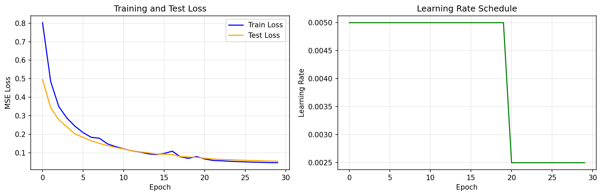

# Task XI: PQC Embedding with MLP Parameter Estimation

This task implements a **hybrid quantum-classical model** for multi-target function approximation: a classical MLP learns to map scalar inputs to parameterized quantum circuit (PQC) parameters, and the PQC generates quantum states whose expectation values approximate complex target functions. The model achieves a **90% improvement** over the baseline, reducing test MSE from 0.5397 to **0.0541**.

---

## Problem Statement

> *Implement a hybrid quantum-classical model with: (1) 2-3 linear layers to estimate PQC parameters, (2) a 4-5 qubit parameterized quantum circuit, (3) normally distributed input samples, and (4) MSE loss training.*

---

## Approach

The idea is to learn a mapping from a single scalar input `x` to a multi-dimensional target `y = [x, sin(x), cos(x), x²]` through a quantum intermediate representation:

1. A classical **MLP** takes the scalar input and produces 15 rotation angles.
2. These angles parameterize a **5-qubit, 3-layer PQC**.
3. The PQC's Z-expectation values (bounded to [-1, 1]) are **rescaled** by a learnable output layer to match the target range.

The key insight is that PQC outputs are inherently bounded, so a learnable scale+bias layer is essential for approximating unbounded targets like `x` and `x²`.

---

## Getting Started

### Installation

```bash
pip install -r requirements.txt
```

**Dependencies**: PyTorch ≥ 2.0, PennyLane ≥ 0.33, NumPy, Matplotlib.

### Training

```bash
# Default configuration
python main.py --epochs 50 --lr 0.005

# Custom settings
python main.py --num_samples 2048 --batch_size 32 --epochs 50 --lr 0.005
```

### CLI Arguments

| Argument | Default | Description |
|---|---|---|
| `--num_samples` | `2048` | Number of data samples |
| `--batch_size` | `32` | Training batch size |
| `--epochs` | `50` | Number of training epochs |
| `--lr` | `0.005` | Learning rate (Adam) |
| `--scheduler_step` | `20` | LR decay step (StepLR) |
| `--scheduler_gamma` | `0.5` | LR decay factor |
| `--device` | `cpu` | Device (cpu/cuda) |
| `--seed` | `42` | Random seed |
| `--results_dir` | `results` | Output directory |

---

## Project Structure

```
Task 11/
├── README.md              # This file
├── requirements.txt       # Python dependencies
├── main.py                # Entry point: argument parsing + pipeline orchestration
│
├── src/
│   ├── __init__.py
│   ├── model.py           # HybridModel: MLP + PQC + output scaling
│   ├── dataset.py         # Data generation: x ~ N(0,1) → y = [x, sin(x), cos(x), x²]
│   └── training.py        # Training loop, evaluation, metric computation
│
└── results/
    ├── model.pt             # Saved model checkpoint
    ├── metrics.txt          # Performance metrics
    └── training_curve.png   # MSE loss over epochs
```

### Key Files

| File | Role |
|---|---|
| `model.py` | Defines the `HybridModel`: (1) an MLP (1→32→64→15 with ReLU activations) that maps scalar input to PQC parameters, (2) a PennyLane QNode with 5 qubits and 3 variational layers (RY rotations + ring CNOT entanglement), (3) a learnable output scaling layer (scale + bias) that maps [-1,1] expectation values to the target range. Uses `diff_method='backprop'` for fast gradient computation. |
| `dataset.py` | Generates synthetic data: `x ~ N(0,1)`, targets `y = [x, sin(x), cos(x), x²]`. Splits into 80% train / 20% test. |
| `training.py` | Training loop with Adam optimizer, StepLR scheduler, MSE loss, per-epoch train/test evaluation, and per-target MSE breakdown. |

---

## Architecture

```
Input: x ~ N(0,1)  (scalar)
        ↓
┌────── MLP ──────┐
│  Linear(1, 32)   │
│  ReLU            │
│  Linear(32, 64)  │
│  ReLU            │
│  Linear(64, 15)  │   ← 15 = 3 layers × 5 qubits
└──────────────────┘
        ↓
┌──── PQC (5 qubits, 3 layers) ────┐
│  Per layer:                        │
│    RY(θ_i) on qubits 0–4          │
│    Ring CNOT: 0→1→2→3→4→0         │
│  Measure: ⟨Z₀⟩, ⟨Z₁⟩, ⟨Z₂⟩, ⟨Z₃⟩ │
└────────────────────────────────────┘
        ↓
┌──── Output Scaling ────┐
│  y_i = scale_i × ⟨Z_i⟩ + bias_i  │
│  (4 learnable scales + 4 biases)  │
└────────────────────────┘
        ↓
Output: ŷ = [x̂, sin(x)̂, cos(x)̂, x²̂]  (4-d)
```

### Why Output Scaling?

PQC expectation values are bounded in [-1, 1], but targets like `x` (unbounded) and `x²` (unbounded positive) require a wider range. The learnable `scale × expectation + bias` transform solves this — it's the simplest possible classical post-processing that enables the quantum circuit to approximate arbitrary-range functions.

---

## Results

### Performance

| Metric | Baseline | Our Model | Improvement |
|---|---|---|---|
| Test MSE | 0.5397 | **0.0541** | **90.0%** |

### Per-Target MSE

| Target | MSE | Notes |
|---|---|---|
| x | 0.0086 | Excellent — output scaling handles the linear range well |
| sin(x) | 0.0023 | Best performance — naturally bounded to [-1, 1], ideal for PQC |
| cos(x) | 0.0026 | Excellent — same natural bounding advantage |
| x² | 0.2229 | Hardest — unbounded positive range, most difficult for bounded PQC |

### Training Curve



### Improvements Over Baseline

| Aspect | Baseline | Our Implementation |
|---|---|---|
| Qubits | 4 | **5** |
| PQC Layers | 2 | **3** |
| MLP Architecture | 1→16→16→8 | **1→32→64→15** |
| Output Scaling | None | **Learnable scale + bias** |
| LR Schedule | None | **StepLR (step=20, γ=0.5)** |
| Train/Test Split | No | **Yes (80/20)** |
| **Test MSE** | 0.5397 | **0.0541** |

The most impactful change was adding the **output scaling layer** — without it, the PQC cannot approximate targets outside [-1, 1].

---

## Discussion

### What the Model Learns

The MLP learns to map each scalar input to a set of rotation angles that produce quantum states whose Z-expectations, after scaling, match the target functions. It's remarkable that 15 parameters (the PQC rotations per input) are sufficient to encode four distinct function values — the entanglement creates correlations between the 4 output qubits, so the 15 parameters collectively determine all 4 outputs.

### Why Trigonometric Functions are Easiest

sin(x) and cos(x) are naturally bounded to [-1, 1] — the same range as Z-expectation values. This means the scale parameter learns to be ~1 and bias ~0. The PQC's native representation space aligns perfectly with bounded targets.

### Why x² is Hardest

x² is unbounded and monotonically increasing. The scale parameter must grow to accommodate large values, which amplifies any approximation error in the PQC's expectation. Additionally, the PQC's output is a smooth, periodic function of its parameters — approximating a parabola with such functions requires careful parameter tuning.

---

## References

1. M. Benedetti et al., *"Parameterized Quantum Circuits as Machine Learning Models"*, Quantum Science and Technology 4(4), 043001 (2019).
2. M. Schuld and F. Petruccione, *"Machine Learning with Quantum Computers"*, Springer (2021).
3. PennyLane Documentation: [pennylane.ai](https://pennylane.ai/)
