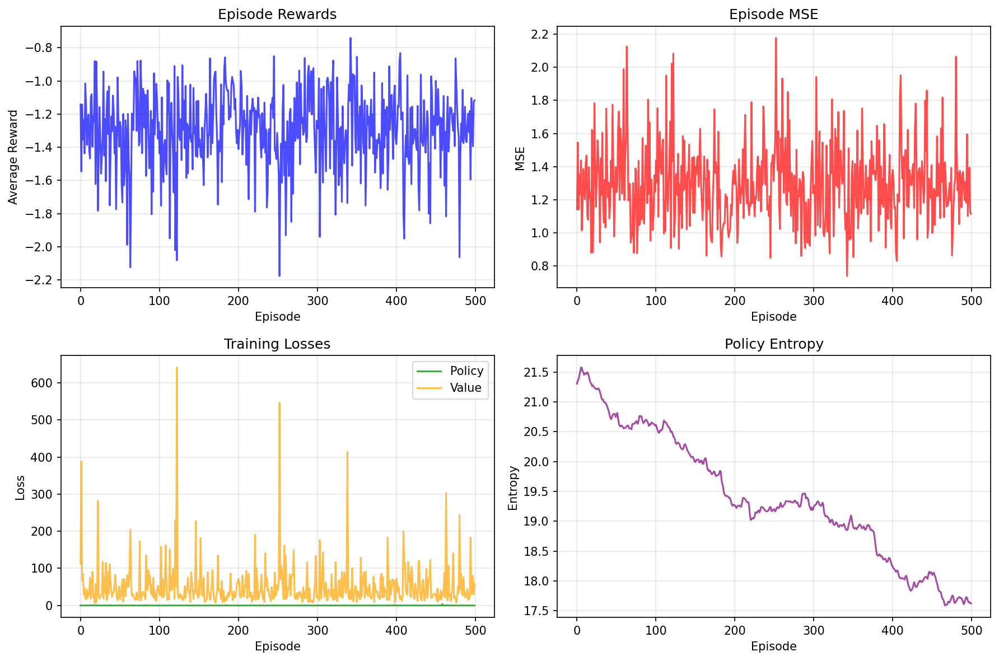

# Task XII: PQC Embedding with Reinforcement Learning

This task reimplements the PQC embedding problem from Task XI, but replaces supervised gradient descent with **Proximal Policy Optimization (PPO)** — a reinforcement learning algorithm. The RL agent learns a policy that maps input states to PQC rotation angles, using negative MSE as the reward signal. While the RL approach successfully learns the task, it achieves an evaluation MSE of **1.04** compared to Task XI's **0.054**, demonstrating that supervised learning is significantly more sample-efficient for regression problems.

---

## Problem Statement

> *Implement Task XI (PQC embedding) using reinforcement learning instead of supervised learning.*

---

## From Supervised Learning to RL

The same function approximation task is reframed as a reinforcement learning problem:

| Aspect | Task XI (Supervised) | Task XII (RL) |
|---|---|---|
| **Input** | x ~ N(0,1) | State s = x |
| **Output** | PQC parameters (directly) | Action a = θ ~ π(·\|s) |
| **Objective** | Minimize MSE loss | Maximize reward = −MSE |
| **Gradient source** | Backpropagation through PQC | Policy gradient (PPO) |
| **Architecture** | Single MLP | Actor + Critic (separate networks) |

---

## Getting Started

### Installation

```bash
pip install -r requirements.txt
```

**Dependencies**: PyTorch ≥ 2.0, PennyLane ≥ 0.33, NumPy, Matplotlib.

### Training

```bash
# Default configuration
python main.py --episodes 500 --steps_per_episode 128

# Custom settings
python main.py --lr_actor 1e-3 --lr_critic 3e-3 --hidden_dim 128
```

### CLI Arguments

| Argument | Default | Description |
|---|---|---|
| `--episodes` | `300` | Number of training episodes |
| `--steps_per_episode` | `64` | Steps (state-action pairs) per episode |
| `--hidden_dim` | `64` | Hidden layer dimension for actor/critic |
| `--lr_actor` | `3e-4` | Actor learning rate |
| `--lr_critic` | `1e-3` | Critic learning rate |
| `--entropy_coef` | `0.01` | Entropy bonus coefficient |
| `--results_dir` | `results` | Output directory |

---

## Project Structure

```
Task 12/
├── README.md              # This file
├── requirements.txt       # Python dependencies
├── main.py                # Entry point: argument parsing + orchestration
│
├── src/
│   ├── __init__.py
│   ├── pqc.py             # PennyLane quantum circuit (same as Task 11)
│   ├── environment.py     # RL environment: state generation, reward computation
│   ├── agent.py           # PPO actor-critic implementation
│   └── training.py        # Training loop, trajectory collection, evaluation
│
└── results/
    ├── agent.pt            # Saved PPO agent checkpoint
    ├── metrics.txt         # Performance metrics
    └── training_curve.png  # Reward / MSE over episodes
```

### Key Files

| File | Role |
|---|---|
| `pqc.py` | PennyLane QNode: 5 qubits, 3 layers of RY rotations + ring CNOT entanglement, returns 4 Z-expectation values. Identical circuit to Task 11, ensuring a fair comparison. |
| `environment.py` | RL environment that wraps the PQC: samples states `x ~ N(0,1)`, receives actions (15 PQC parameters clipped to [-π, π]), computes reward as `-MSE(PQC(θ), [x, sin(x), cos(x), x²])`. Each step is independent (contextual bandit structure). |
| `agent.py` | PPO implementation with separate actor and critic networks. The **actor** (1→128→128→15) outputs a mean vector for a Gaussian policy with learnable log-std. The **critic** (1→128→128→1) estimates state value. Includes GAE advantage estimation, PPO clipping, and entropy bonus. |
| `training.py` | Collects multi-step trajectories, computes GAE advantages, runs multiple PPO update epochs with mini-batches, and evaluates the deterministic policy at the end. |

---

## Architecture

```
State s = x ~ N(0,1)
        ↓
┌───────────────────┬────────────────────┐
│      ACTOR        │      CRITIC         │
│   1→128→128→15    │   1→128→128→1       │
│   → Mean μ        │   → Value V(s)      │
│   + log_std σ     │                     │
└────────┬──────────┴─────────────────────┘
         ↓
Sample a ~ N(μ, σ²)   ← Action = 15 PQC parameters
         ↓
Clip to [-π, π]
         ↓
┌──── PQC (5 qubits, 3 layers) ────┐
│  Same circuit as Task 11           │
│  RY rotations + ring CNOT         │
│  → 4 Z-expectations               │
└────────────────────────────────────┘
         ↓
Reward = -MSE(output, [x, sin(x), cos(x), x²])
```

### PPO Configuration

| Parameter | Value |
|---|---|
| Algorithm | PPO (with GAE) |
| Episodes | 500 |
| Steps per episode | 128 |
| Actor hidden dim | 128 |
| Actor LR | 1e-3 |
| Critic LR | 3e-3 |
| Discount γ | 0.99 |
| GAE λ | 0.95 |
| Clip ε | 0.2 |
| Entropy coefficient | 0.005 |
| PPO epochs per update | 10 |
| Mini-batch size | 32 |

---

## Results

### Performance

| Metric | Value |
|---|---|
| Best Training MSE | 0.7407 |
| **Evaluation MSE** | **1.0438** |

### Per-Target MSE

| Target | MSE | Notes |
|---|---|---|
| x | 1.3071 | Unbounded — hardest for PQC |
| sin(x) | 0.6629 | Reasonably approximated |
| cos(x) | 0.1421 | Best target — bounded, matches PQC range |
| x² | 2.0631 | Worst — unbounded positive |

### Comparison with Task XI (Supervised)

| Approach | Test MSE | Method |
|---|---|---|
| Task 11 Baseline (Supervised) | 0.5397 | Direct backprop |
| Task 11 Optimized (Supervised) | **0.0541** | Backprop + output scaling |
| **Task 12 (RL/PPO)** | **1.0438** | Policy gradient |

The supervised approach achieves **~19× better MSE**.

### Training Curve



---

## Discussion

### Why RL Underperforms Supervised Learning Here

This is expected, and the gap is instructive:

1. **Sample efficiency**: RL must explore the action space stochastically, while supervised learning directly computes the gradient of the loss. For a 15-dimensional continuous action space, this exploration overhead is substantial.

2. **High variance**: policy gradient estimates are inherently noisy — even with GAE and the PPO clipping objective, variance is much higher than backpropagation gradients.

3. **Credit assignment**: the RL agent must attribute reward to specific parameter choices across 15 dimensions simultaneously, without the benefit of per-parameter gradient information.

4. **No output scaling**: the RL environment doesn't include a learnable output scaling layer (since actions are the PQC parameters directly, not model weights), so the PQC's bounded output range limits the achievable MSE for unbounded targets.

5. **Problem structure mismatch**: this is essentially a **contextual bandit** (each step is independent, there's no sequential decision-making), and RL is designed for sequential problems. The PPO overhead provides no benefit over direct optimization.

### What RL Got Right

Despite the overall higher MSE, the per-target breakdown is informative:
- **cos(x)** (MSE = 0.14) is well-approximated because its range [-1, 1] matches the PQC's output range.
- The agent did **learn a meaningful policy** — it produces better-than-random PQC parameters conditioned on the input state.

### When Would RL Be Better?

RL would outperform supervised learning for PQC parameter estimation when:
- The **reward signal is not differentiable** (e.g., quantum hardware with shot noise).
- There are **sequential dependencies** between decisions.
- The **environment dynamics are unknown** and must be discovered through interaction.
- The reward is **sparse or delayed** rather than available at every step.

---

## References

1. J. Schulman et al., *"Proximal Policy Optimization Algorithms"*, [arXiv:1707.06347](https://arxiv.org/abs/1707.06347)
2. OpenAI Spinning Up — PPO Implementation Guide: [spinningup.openai.com](https://spinningup.openai.com/)
3. PennyLane Documentation: [pennylane.ai](https://pennylane.ai/)