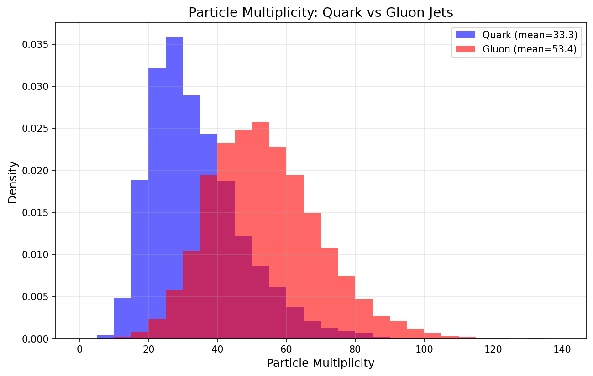
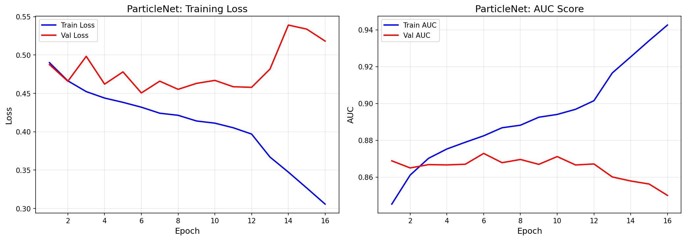
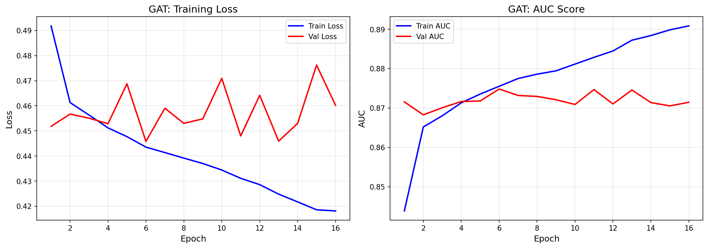
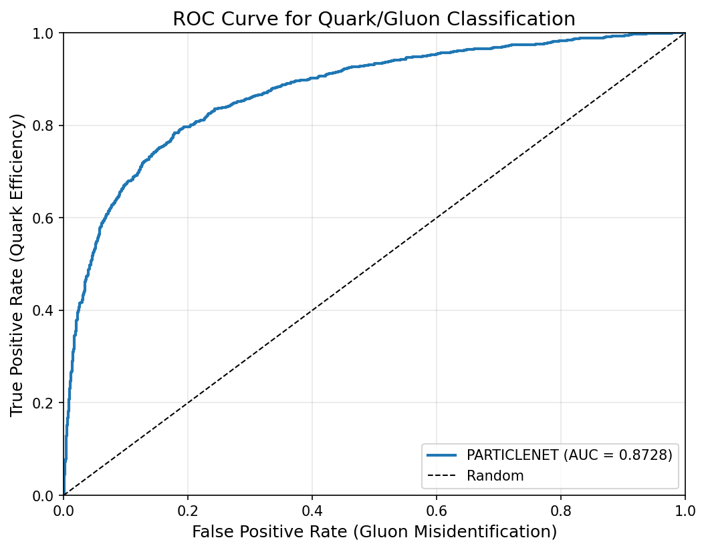
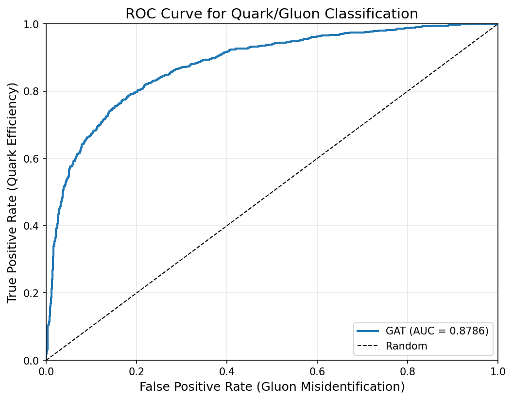
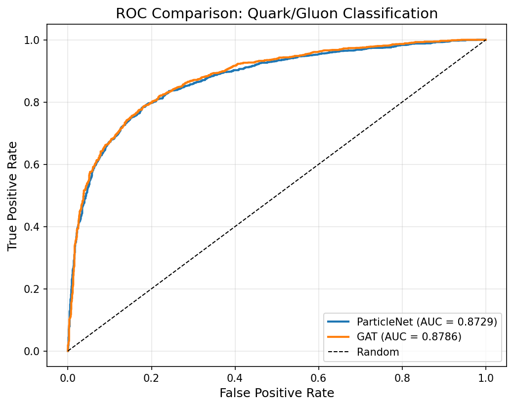
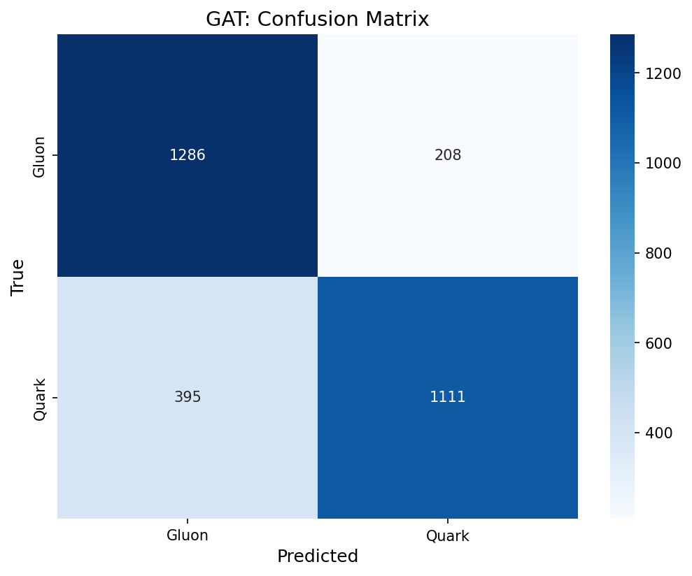
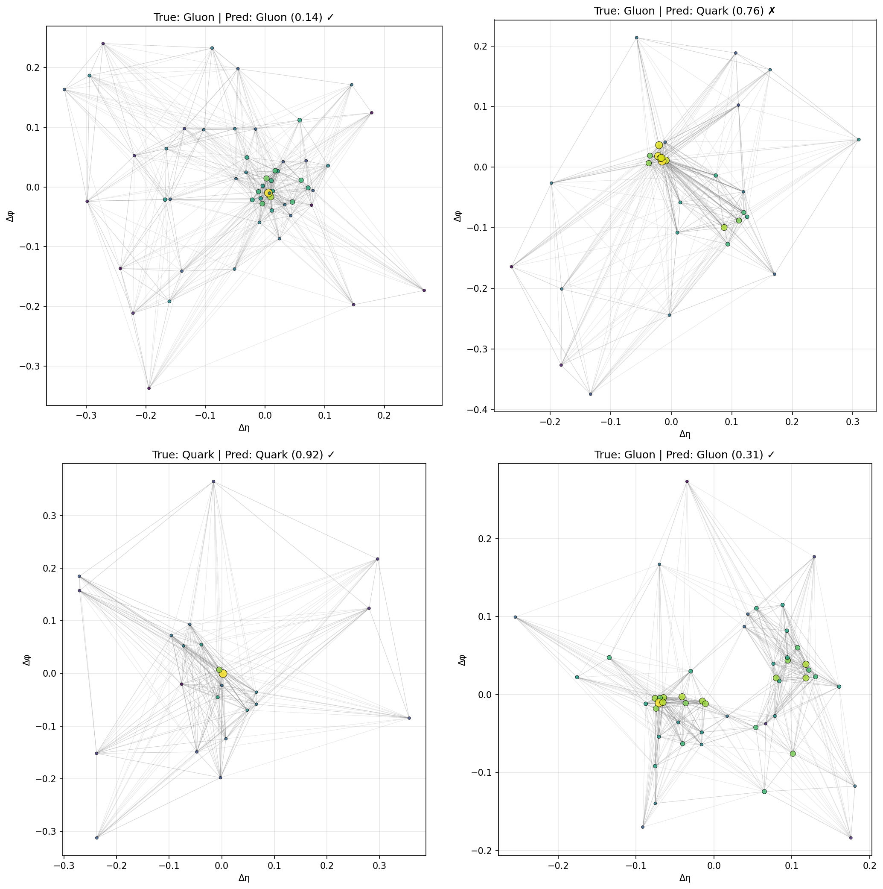

# Task II: Quark/Gluon Jet Classification with Graph Neural Networks

This task implements two Graph Neural Network architectures — **ParticleNet (Dynamic EdgeConv)** and a **Graph Attention Network (GATv2)** — to classify particle jets as originating from quarks or gluons, using the ParticleNet quark/gluon dataset.

---

## Problem Statement

Using ParticleNet's quark/gluon jet classification dataset ([Zenodo](https://zenodo.org/records/3164691#.YigdGt9MHrB)):

1. Choose **2 graph-based architectures** to classify jets as quarks or gluons.
2. Describe the considerations taken to **project the point-cloud dataset to a set of interconnected nodes and edges**.
3. Discuss the **resulting performance** of the 2 chosen architectures.

### Dataset

The dataset consists of quark and gluon jets generated with Pythia 8, loaded via the [EnergyFlow](https://energyflow.network/docs/datasets/#quark-and-gluon-jets) Python package.

| Property | Value |
|---|---|
| Generator | Pythia 8.226 / 8.235, √s = 14 TeV |
| Jet algorithm | anti-kT, R = 0.4 (FastJet 3.3.0) |
| Jet pT | 500–550 GeV |
| Jet rapidity | \|y\| < 1.7 |
| Samples per file | 100,000 (50k quark + 50k gluon) |
| Particle features | pT, rapidity (η), azimuthal angle (φ), pdgid |

---

## Approach

Jets are naturally **point clouds** — unordered sets of particles in (η, φ) space. Graphs offer a natural representation because they:

- Respect **permutation invariance** (no arbitrary particle ordering)
- Enable **relational learning** between particle pairs
- Handle **variable-size** jets without fixed-length padding
- Can encode **physically meaningful** spatial relationships

We implement two architectures that represent complementary GNN paradigms:

| | ParticleNet (EdgeConv) | GAT (GATv2Conv) |
|---|---|---|
| **Graph type** | Dynamic — k-NN recomputed in learned feature space each layer | Static — k-NN computed once from input coordinates |
| **Aggregation** | MLP on edge features → max-pool | Attention-weighted sum |
| **Strength** | Learns optimal graph structure | Interpretable attention weights |
| **Parameters** | ~500K | ~300K |

---

## Getting Started

### Installation

```bash
pip install -r requirements.txt
```

**Dependencies**: PyTorch ≥ 2.0, PyTorch Geometric ≥ 2.3, EnergyFlow ≥ 1.3, NumPy, scikit-learn, matplotlib, seaborn, tqdm.

> **Note**: The dataset is downloaded automatically via the EnergyFlow package on first run (~1.5 GB). No manual download needed.

### Training

```bash
# Train both models (default)
python train.py --model both --epochs 50 --batch_size 128

# Train only ParticleNet
python train.py --model particlenet --epochs 50

# Train only GAT
python train.py --model gat --epochs 50
```

### Evaluation

```bash
# Evaluate a saved ParticleNet checkpoint
python evaluate.py --model particlenet --checkpoint results/particlenet_best.pt --visualize

# Evaluate a saved GAT checkpoint
python evaluate.py --model gat --checkpoint results/gat_best.pt --visualize
```

### CLI Arguments

**`train.py`**

| Argument | Default | Description |
|---|---|---|
| `--model` | `both` | Which model to train: `particlenet`, `gat`, or `both` |
| `--num_data` | `100000` | Number of jets to load from EnergyFlow |
| `--batch_size` | `128` | Training batch size |
| `--epochs` | `50` | Maximum training epochs |
| `--lr` | `1e-3` | Initial learning rate (Adam) |
| `--k` | `16` | Number of neighbors for k-NN graph construction |
| `--dropout` | `0.3` | Dropout probability |
| `--patience` | `10` | Early stopping patience (epochs without val AUC improvement) |
| `--save_dir` | `results` | Directory to save checkpoints and plots |
| `--seed` | `42` | Random seed for reproducibility |

**`evaluate.py`**

| Argument | Default | Description |
|---|---|---|
| `--model` | *(required)* | Model type: `particlenet` or `gat` |
| `--checkpoint` | *(required)* | Path to saved `.pt` checkpoint |
| `--visualize` | `False` | Generate sample jet visualizations with predictions |
| `--num_data` | `100000` | Number of jets to load |
| `--batch_size` | `128` | Batch size for evaluation |
| `--k` | `16` | k-NN neighbors (must match training) |
| `--save_dir` | `results` | Output directory for plots |

### Jupyter Notebook

`Task_2.ipynb` contains an interactive walkthrough of the full pipeline — data loading, preprocessing, model training, evaluation, and visualization — and can be used to reproduce results without the CLI.

---

## Project Structure

```
Task 2/
├── README.md               # This file
├── requirements.txt         # Python dependencies
├── train.py                 # Main training script (CLI entry point)
├── evaluate.py              # Evaluation + visualization script
├── Task_2.ipynb             # Interactive notebook walkthrough
│
├── src/
│   ├── __init__.py
│   ├── data/
│   │   ├── __init__.py
│   │   ├── dataset.py       # JetGraphDataset class & EnergyFlow data loading
│   │   └── preprocessing.py # Jet centering, feature engineering, k-NN graph building
│   │
│   ├── models/
│   │   ├── __init__.py
│   │   ├── particle_net.py  # ParticleNet with custom EdgeConv blocks
│   │   └── gat_classifier.py # GAT classifier with GATv2Conv blocks
│   │
│   ├── training/
│   │   ├── __init__.py
│   │   ├── trainer.py       # Training loop, validation, early stopping, checkpointing
│   │   └── metrics.py       # ROC/AUC computation, training history & ROC plotting
│   │
│   └── utils/
│       ├── __init__.py
│       └── visualization.py # Jet plots, graph visualization, attention weights, confusion matrices
│
└── results/                 # Saved checkpoints, plots, and metrics
    ├── particlenet_best.pt  # Best ParticleNet checkpoint
    ├── gat_best.pt          # Best GAT checkpoint
    ├── roc_comparison.png   # Head-to-head ROC comparison
    ├── particlenet_history.png / gat_history.png
    ├── particlenet_roc.png / gat_roc.png
    ├── particlenet_confusion.png / gat_confusion.png
    ├── particlenet_sample_jets.png / gat_sample_jets.png
    └── multiplicity_distribution.png
```

### Key Files

| File | Role |
|---|---|
| `dataset.py` | Loads jet data via EnergyFlow, wraps each jet as a PyG `Data` object with node features, edge indices, and edge attributes. Creates train/val/test splits (70/15/15). |
| `preprocessing.py` | Removes zero-padded particles, centers each jet at its pT-weighted centroid, computes 5 node features (Δη, Δφ, log pT, log E, pT fraction), builds k-NN graphs, and computes 3 edge features (ΔR, Δη, Δφ). |
| `particle_net.py` | Implements ParticleNet using custom `EdgeConvBlock` modules with a batch-aware k-NN function (no `torch-cluster` dependency). Uses residual connections and batch normalization. |
| `gat_classifier.py` | Implements the GAT classifier using PyG's `GATv2Conv` with multi-head attention, residual connections, and optional attention weight extraction for interpretability. |
| `trainer.py` | Generic `Trainer` class with Adam optimizer, `ReduceLROnPlateau` scheduler, gradient clipping, early stopping, and model checkpointing. |
| `metrics.py` | Computes accuracy, AUC, per-class precision/recall. Generates ROC curves (single and comparative) and training history plots. |
| `visualization.py` | Renders jet displays in (η, φ) space with pT-scaled markers, k-NN graph edges, attention-weighted edges, confusion matrix heatmaps, and multiplicity histograms. |

---

## Graph Construction: From Point Clouds to Graphs

A particle jet is an unordered set of particles, each described by kinematic variables. Converting this point cloud into a graph requires choosing how to define **nodes**, **edges**, and **features**.

### Nodes

Each particle in the jet becomes a node. Zero-padded particles (pT = 0) are removed first, so graph sizes vary per jet.

### Edges (k-Nearest Neighbors)

We connect each particle to its **k = 16 nearest neighbors** in (Δη, Δφ) coordinate space, using Euclidean distance:

$$d_{ij} = \sqrt{(\Delta\eta_i - \Delta\eta_j)^2 + (\Delta\phi_i - \Delta\phi_j)^2}$$

This choice is motivated by:

- **Physics**: nearby particles in the η–φ plane originate from related fragmentation processes and are physically correlated.
- **Efficiency**: a fixed number of edges per node makes batching straightforward.
- **Precedent**: k = 16 was the empirically optimal value in the ParticleNet paper.

Alternative graph constructions (fully connected, radius graphs, etc.) were considered but rejected — fully connected graphs scale as O(n²) and introduce spurious long-range connections, while radius graphs produce variable edge counts that complicate batching.

### Node Features (5 per particle)

| Feature | Formula | Motivation |
|---|---|---|
| Δη | η − η_centroid | Spatial position (translation-invariant) |
| Δφ | φ − φ_centroid | Spatial position (translation-invariant) |
| log(pT) | log(pT + ε) | Compresses the large dynamic range of momenta |
| log(E) | log(pT · cosh η + ε) | Energy on a log scale |
| pT fraction | pT / ΣpT | Relative importance of the particle within the jet |

The jet is centered by subtracting the **pT-weighted centroid** in (η, φ), and φ-wrapping is handled via `arctan2`.

### Edge Features (3 per edge, used by GAT)

| Feature | Description |
|---|---|
| ΔR_ij | Angular distance between particles i and j |
| Δη_ij | Rapidity difference |
| Δφ_ij | Azimuthal angle difference |

ParticleNet computes edge features implicitly (as `h_j − h_i` in feature space), so it does not use these explicit edge attributes.

### Static vs Dynamic Graphs

- The **GAT** model uses a **static graph**: k-NN is computed once from input (Δη, Δφ) coordinates and stays fixed through all layers.
- **ParticleNet** uses a **dynamic graph**: after each EdgeConv layer, k-NN is recomputed in the *learned feature space*, allowing the model to discover new particle relationships layer by layer.

---

## Architecture Details

### 1. ParticleNet (Dynamic EdgeConv)

Based on *Dynamic Graph CNN for Learning on Point Clouds* (Wang et al., 2019) and *ParticleNet: Jet Tagging via Particle Clouds* (Qu & Gouskos, 2019).

**Core operation** — for each node *i*, aggregate over neighbors *j*:

```
h_i' = max_{j ∈ N(i)} MLP( h_i ‖ (h_j − h_i) )
```

The source node features `h_i` are concatenated with the edge features `(h_j − h_i)`, passed through an MLP, and aggregated via max-pooling. The neighbor set N(i) is recomputed via k-NN in the current feature space after each block.

**Architecture**:

```
Input: 5 node features
    ↓
BatchNorm(5)
    ↓
EdgeConv Block 1:  5 → 64   (MLP: 10→64→64→64, BN+ReLU, residual shortcut)
    ↓  [k-NN recomputed in 64-d space]
EdgeConv Block 2:  64 → 128  (MLP: 128→128→128→128)
    ↓  [k-NN recomputed in 128-d space]
EdgeConv Block 3:  128 → 256 (MLP: 256→256→256→256)
    ↓
Global Pool: mean ⊕ max → 512-d
    ↓
Classifier: 512 → 256 → 128 → 2  (Linear + BN + ReLU + Dropout(0.3))
```

**Parameters**: ~500K trainable · **k**: 16 neighbors

The implementation avoids the `torch-cluster` dependency by using a custom batch-aware k-NN computation via `torch.cdist` and `topk`.

### 2. GAT Classifier (GATv2Conv)

Based on *Graph Attention Networks* (Veličković et al., 2018) and *How Attentive are Graph Attention Networks?* (Brody et al., 2021).

**Core operation** — GATv2 attention:

```
α_ij = softmax_j( a^T · LeakyReLU( W · [h_i ‖ h_j] ) )
h_i' = Σ_j  α_ij · W · h_j
```

Unlike GAT v1 (which computes attention *before* the non-linearity, making it effectively static), GATv2 applies LeakyReLU *after* concatenation, enabling truly dynamic attention that depends on both source and target node features.

**Architecture**:

```
Input: 5 node features + 3 edge features
    ↓
BatchNorm(5)
    ↓
GATv2 Block 1:  5 → 64 × 4 heads = 256  (concat, residual shortcut)
    ↓
GATv2 Block 2:  256 → 64 × 4 heads = 256
    ↓
GATv2 Block 3:  256 → 64  (heads averaged, not concatenated)
    ↓
Global Pool: mean ⊕ max → 128-d
    ↓
Classifier: 128 → 128 → 64 → 2  (Linear + BN + ReLU + Dropout(0.3))
```

**Parameters**: ~300K trainable · **Heads**: 4 · **Edge features**: 3 (ΔR, Δη, Δφ)

Attention weights are extractable per-layer via `return_attention_weights`, enabling visualization of which particle pairs the model considers most important.

---

## Design Considerations

### Why These Two Architectures?

We sought two architectures that offer **complementary paradigms** for comparison:

| | ParticleNet | GAT |
|---|---|---|
| Graph construction | Dynamic (learns structure) | Static (physics-driven) |
| Neighbor weighting | Uniform (max-pool) | Learned (attention) |
| Interpretability | Low | High (attention maps) |
| HEP track record | State-of-the-art on this dataset | Well-established baseline |

### Why Not Others?

| Architecture | Reason for exclusion |
|---|---|
| **GIN** (Graph Isomorphism Network) | Maximally expressive in theory, but no native edge feature support and less interpretable. |
| **TransformerConv** | O(n²) self-attention is expensive for jets with 50+ particles and loses the locality inductive bias. |
| **LorentzNet** | Lorentz-equivariant design is elegant but over-engineered for a narrow pT window (500–550 GeV) where kinematic variation is limited. |
| **GraphSAGE** | Designed for large-scale inductive settings (social networks, etc.), not well-suited for small, dense particle graphs. |

### Training Details

Both models share these training settings:

| Hyperparameter | Value |
|---|---|
| Optimizer | Adam (weight decay = 1e-4) |
| Learning rate | 1e-3, with `ReduceLROnPlateau` (factor=0.5, patience=5) |
| Gradient clipping | max norm = 1.0 |
| Early stopping | Patience = 10 (on validation AUC) |
| Data splits | 70% train / 15% validation / 15% test |
| Loss function | Cross-entropy |

---

## Results

### Multiplicity Distribution

The first sanity check: gluon jets should contain more particles than quark jets, consistent with the larger color factor of gluons (C_A = 3 vs C_F = 4/3).



### Training Curves

**ParticleNet**


**GAT**


### ROC Curves

**Individual ROC curves:**

| ParticleNet | GAT |
|:-----------:|:---:|
|  |  |

**Head-to-head comparison:**



### Confusion Matrices

| ParticleNet | GAT |
|:-----------:|:---:|
|  |  |

### Sample Jet Visualizations

These plots show sample jets in (Δη, Δφ) space with k-NN graph edges, colored by log(pT). Each subplot shows the true label, predicted label, and prediction confidence.

| ParticleNet | GAT |
|:-----------:|:---:|
|  |  |

---

## Discussion

### Performance Comparison

Both models perform well on the quark/gluon classification task, with ParticleNet holding a slight edge — consistent with its state-of-the-art status on this exact benchmark.

ParticleNet's advantage likely stems from its **dynamic graph construction**: by recomputing the k-NN graph in learned feature space after each layer, it can discover particle groupings that are not apparent from spatial proximity alone. The GAT model, while competitive, is limited by its static graph — it can only re-weight the importance of spatially nearby particles, not discover new connections.

That said, the GAT model's **interpretability** is a genuine advantage in a physics context. Attention weights can reveal which particle pairs the model relies on for its decision, potentially offering physical insight into the discriminating structures of quark vs gluon jets.

### On Graph Construction Choices

The k-NN approach with k = 16 in (Δη, Δφ) space strikes a good balance. A few observations:

- **k = 16** captures a reasonable fraction of each jet's particles (typical multiplicity is 15–30 for quarks, 20–40 for gluons), so each node "sees" a large portion of its jet.
- **Centered coordinates** (Δη, Δφ relative to the pT-weighted centroid) provide translation invariance — the model sees the same local structure regardless of where the jet is in the detector.
- **Log-scaled features** (log pT, log E) are critical because particle momenta span several orders of magnitude within a single jet.

### Physical Insights

The separate treatment of quark and gluon jets reflects real QCD differences:

- **Gluon jets** have higher multiplicity and broader spatial extent due to the larger color charge (C_A = 3).
- **Quark jets** are narrower with harder fragmentation (C_F = 4/3).

Both models learn to exploit these differences — the multiplicity distribution plot confirms the expected separation in particle counts, and the trained classifiers achieve AUC scores well above random (0.5), demonstrating that the graph-based representations capture physically meaningful structure.

---

## References

1. H. Qu and L. Gouskos, *"ParticleNet: Jet Tagging via Particle Clouds"*, Phys. Rev. D 101, 056019 (2020). [arXiv:1902.08570](https://arxiv.org/abs/1902.08570)
2. Y. Wang et al., *"Dynamic Graph CNN for Learning on Point Clouds"*, ACM TOG 38(5), 2019. [arXiv:1801.07829](https://arxiv.org/abs/1801.07829)
3. P. Veličković et al., *"Graph Attention Networks"*, ICLR 2018. [arXiv:1710.10903](https://arxiv.org/abs/1710.10903)
4. S. Brody, U. Alon, and E. Yahav, *"How Attentive are Graph Attention Networks?"*, ICLR 2022. [arXiv:2105.14491](https://arxiv.org/abs/2105.14491)
5. P. T. Komiske, E. M. Metodiev, and J. Thaler, *"Energy Flow Networks: Deep Sets for Particle Jets"*, JHEP 01, 121 (2019). [arXiv:1810.05165](https://arxiv.org/abs/1810.05165)
6. M. Fey and J. E. Lenssen, *"Fast Graph Representation Learning with PyTorch Geometric"*, ICLR Workshop on Representation Learning on Graphs and Manifolds, 2019. [arXiv:1903.02428](https://arxiv.org/abs/1903.02428)