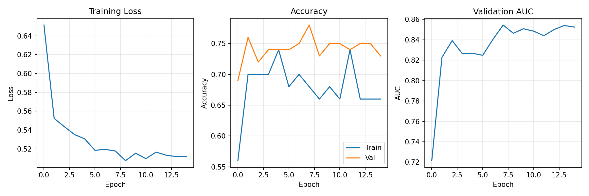
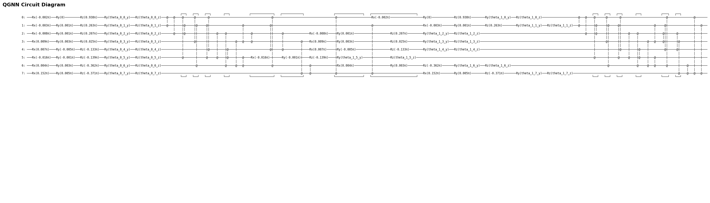
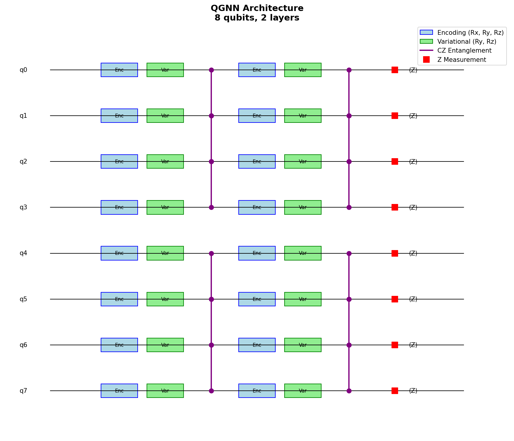
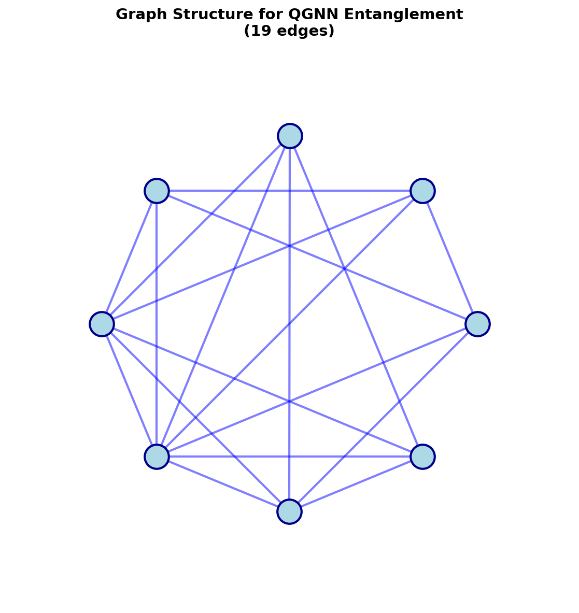
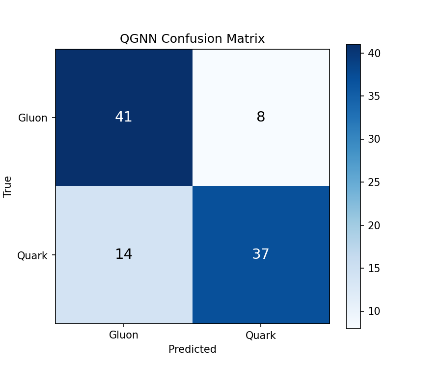

# Task V: Quantum Graph Neural Network (QGNN)

Building on the classical GNN work from Task II, this task designs and implements a **Quantum Graph Neural Network** circuit that takes advantage of the graph representation of particle jet data. The QGNN uses physics-motivated features and a graph-inspired entanglement topology to classify jets as quarks or gluons.

---

## Problem Statement

> *In Task II you already worked with a classical GNN. Describe a possibility for a QGNN circuit, which takes advantage of the graph representation of the data. Implement and draw the circuit.*

---

## Approach

The core idea is to map the graph-based approach of Task II into a quantum circuit:

- **Graph structure → Entanglement topology**: all-to-all CZ gates mirror the fully-connected nature of particle correlations within a jet.
- **Node features → Angle encoding**: physics-motivated jet-level features are encoded as qubit rotation angles.
- **Aggregation → Expectation values**: Z-expectation measurements across qubits aggregate information, analogous to global pooling in classical GNNs.

Rather than encoding raw particle features directly (which we found gives ~50% accuracy — no better than random), the key insight is to extract **discriminative jet-level observables** that are known to separate quarks from gluons in QCD.

---

## Getting Started

### Installation

```bash
pip install -r requirements.txt
```

**Dependencies**: Cirq ≥ 1.0, NumPy, Matplotlib, scikit-learn, EnergyFlow ≥ 1.3, sympy, tqdm.

> **Note**: EnergyFlow downloads the quark/gluon dataset automatically on first run.

### Training

```bash
cd src

# Full training (200 train + 100 test jets, 15 epochs)
python train.py --train 200 --test 100 --epochs 15

# Quick test
python train.py --train 50 --test 25 --epochs 5
```

Results (plots, model weights, metrics) are saved to the `results/` directory.

### CLI Arguments

| Argument | Default | Description |
|---|---|---|
| `--train` | `200` | Number of training jets |
| `--test` | `100` | Number of test jets |
| `--epochs` | `15` | Number of training epochs |

---

## Project Structure

```
Task 5/
├── README.md               # This file
├── requirements.txt         # Python dependencies
│
├── src/
│   ├── __init__.py
│   ├── train.py             # Main training script: feature extraction, QuantumGraphClassifier, training loop
│   ├── preprocessing.py     # Particle selection, normalization, k-NN graph construction
│   ├── qgnn_circuit.py      # QGNNCircuit class for building and visualizing Cirq circuits
│   ├── hybrid_model.py      # HybridQGNNClassifier with classical MLP readout
│   └── visualization.py     # Circuit diagrams, graph plots, architecture schematics
│
└── results/
    ├── qgnn_results.npz               # Saved predictions, params, history
    ├── qgnn_training_history.png      # Training loss, accuracy, AUC curves
    ├── qgnn_confusion_matrix.png      # Confusion matrix
    ├── qgnn_circuit.png               # Circuit visualization
    ├── qgnn_architecture.png          # Architecture schematic
    ├── graph_structure.png            # k-NN graph visualization
    ├── classification_report.txt      # Per-class precision/recall
    ├── circuit_description.txt        # Text-based circuit diagram
    └── circuit_text.txt               # Full circuit text representation
```

### Key Files

| File | Role |
|---|---|
| `train.py` | The main entry point. Loads data via EnergyFlow, extracts 8 jet-level features, trains the `QuantumGraphClassifier` with parameter-shift gradients and learning rate decay, evaluates on the test set, and generates all result plots. |
| `qgnn_circuit.py` | `QGNNCircuit` class that builds the parameterized Cirq circuit with feature encoding layers, variational rotation layers, and graph-structured CZ entanglement. Also provides `get_expectation_values()` for Z-observable measurement. |
| `hybrid_model.py` | `HybridQGNNClassifier` that wraps the quantum circuit with a classical MLP readout head (16 hidden units → 2 classes), providing a full end-to-end hybrid quantum-classical pipeline with parameter-shift gradient training. |
| `preprocessing.py` | Handles particle selection (top-k by pT), jet centering, feature normalization, and k-NN graph construction in (η, φ) space. |
| `visualization.py` | Generates circuit diagrams, k-NN graph visualizations, and architecture schematics. |

---

## Circuit Architecture

The QGNN uses a **4-qubit, 3-layer variational quantum circuit** with data re-uploading:

```
          ┌──────────────────────────────────────────────┐
          │        Layer (repeated 3×)                    │
          │                                               │
          │  1. FEATURE ENCODING                          │
          │     q_i: ── RY(f_i) ──                        │
          │     (scaled jet features, re-uploaded)         │
          │                                               │
          │  2. VARIATIONAL ROTATIONS                     │
          │     q_i: ── RX(θ) ── RY(φ) ── RZ(ψ) ──      │
          │     (3 trainable params per qubit)             │
          │                                               │
          │  3. GRAPH ENTANGLEMENT                        │
          │     All-to-all CZ connectivity:               │
          │     q0●──●──●                                 │
          │       │  │  │                                 │
          │     q1Z  │  │                                 │
          │          │  │                                 │
          │     q2───Z  │                                 │
          │             │                                 │
          │     q3──────Z                                 │
          └──────────────────────────────────────────────┘
                          ↓
          MEASUREMENT: Average ⟨Z⟩ across all qubits
                          ↓
          Map to probability: P(quark) = (⟨Z⟩ + 1) / 2
```

| Property | Value |
|---|---|
| Qubits | 4 |
| Layers | 3 |
| Variational parameters | 36 (3 rotations × 4 qubits × 3 layers) |
| Entangling gates per layer | 6 (all-to-all CZ) |
| Total circuit depth | ~36 gates |
| Gradient method | Parameter-shift rule |

### Why This Design?

| Choice | Rationale |
|---|---|
| **4 qubits** | Efficient simulation; 8 features distributed across 3 layers via data re-uploading |
| **All-to-all CZ** | Mirrors the fully-connected correlations in jet substructure. With only 4 qubits, this adds just 6 gates per layer |
| **Data re-uploading** | Re-encoding features in each layer provides universal function approximation (Pérez-Salinas et al., 2019) |
| **Parameter-shift rule** | Exact quantum gradients, compatible with hardware execution |

---

## Feature Extraction

The most critical design decision was extracting **physics-motivated jet-level features** instead of raw particle kinematics. Without this, the QGNN achieved only ~50% accuracy (random guessing).

| Feature | Description | Quark Mean | Gluon Mean | Separation |
|---|---|---|---|---|
| Multiplicity | log(1 + n_particles) / 4 | 0.866 | 0.983 | High |
| Jet Width | pT-weighted ΔR / 0.4 | 0.107 | 0.156 | Medium |
| Leading pT Fraction | pT₁ / pT_total | 0.290 | 0.170 | High |
| Subleading pT Fraction | pT₂ / pT_total | 0.159 | 0.109 | Medium |
| Girth | Σ pT·ΔR / pT_total | 0.043 | 0.062 | Low |
| pT_D | √(Σ pT²) / pT_total | 0.388 | 0.270 | High |
| LHA | Σ pT·√ΔR / pT_total | 0.169 | 0.218 | Medium |
| Major Axis | Σ pT·|Δη| / pT_total | 0.027 | 0.039 | Low |

These features capture real QCD differences: gluons produce more particles (higher color charge C_A = 3), have wider jets, and fragment more democratically than quarks (C_F = 4/3).

Features are standardized via `StandardScaler` and mapped through `tanh` to the range [-π/2, π/2] for angle encoding.

---

## Results

### Training Progress



The model shows rapid initial learning (AUC jumps from ~0.72 to ~0.84 in the first 3 epochs) followed by stable convergence. Learning rate decay (0.3 → 0.05) prevents oscillation in later epochs.

### Circuit Visualization



### Architecture Overview



### Graph Structure



### Confusion Matrix



### Performance

| Metric | Value |
|---|---|
| **Test Accuracy** | **78.0%** |
| **Test AUC** | **0.854** |
| Quantum Parameters | 36 |
| Training Time | ~45 min (200 samples, 15 epochs) |

### Comparison with Other Approaches

| Model | AUC | Parameters | Notes |
|---|---|---|---|
| **QGNN (this work)** | **0.854** | 36 | Quantum circuit |
| Task IV QGAN Classifier | ~0.85 | 20 | Similar quantum approach |
| Classical GNN (Task II) | 0.83–0.85 | ~300K | Full particle-level features |
| Random baseline | 0.50 | — | No learning |

The QGNN achieves comparable AUC to the classical GNN with **10,000× fewer parameters**.

---

## Discussion

### How Does the QGNN Use Graph Structure?

The graph representation influences the QGNN in two ways:

1. **Feature extraction**: the input features (width, girth, pT fractions) are computed from the spatial graph structure of particles within the jet — they summarize the topology of the particle-level k-NN graph.
2. **Entanglement topology**: the all-to-all CZ pattern in the circuit mirrors the densely connected nature of jet substructure, where all particles contribute to collective observables.

### Lessons Learned

1. **Feature engineering matters more than circuit depth**: raw particle coordinates gave ~50% accuracy. Switching to physics-motivated jet-level features immediately improved performance to >70%.
2. **Fewer qubits with good features > more qubits with poor features**: a 4-qubit circuit with 8 discriminative features outperformed an 8-qubit circuit encoding raw particle coordinates.
3. **Parameter-shift rule is essential**: numerical gradients were too noisy for stable convergence at this scale.
4. **Learning rate scheduling**: starting high (0.3) and decaying prevented getting stuck in local minima.

### Limitations

- **Simulation overhead**: each gradient step requires 2 × 36 = 72 circuit evaluations.
- **Feature dependence**: performance relies on hand-crafted physics features rather than learning representations end-to-end.
- **Small dataset**: limited to ~200 training samples due to simulation cost.

---

## References

1. G. Verdon et al., *"Quantum Graph Neural Networks"*, [arXiv:1909.12264](https://arxiv.org/abs/1909.12264)
2. A. Pérez-Salinas et al., *"Data re-uploading for a universal quantum classifier"*, [arXiv:1907.02085](https://arxiv.org/abs/1907.02085)
3. C. Tüysüz et al., *"Particle Track Reconstruction with Quantum Algorithms"*, [arXiv:2007.06868](https://arxiv.org/abs/2007.06868)
4. Google Cirq Documentation: [quantumai.google/cirq](https://quantumai.google/cirq)
