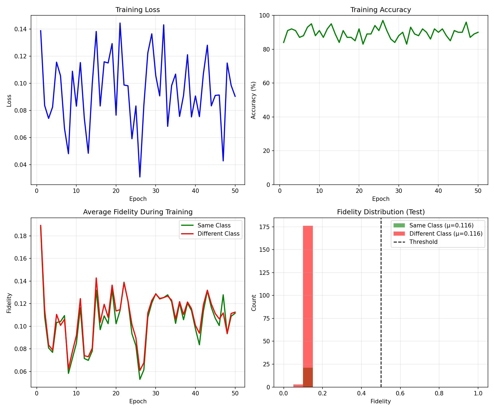

# Task VI: Quantum Representation Learning

This task implements a **Quantum Similarity Network** that learns to compare MNIST digit images using a quantum SWAP test. The model learns trainable quantum state preparations that map images to quantum states, then measures their overlap (fidelity) to determine whether two images belong to the same class — achieving **89.5% test accuracy** with just **16 trainable parameters**.

---

## Problem Statement

> *Implement quantum representation learning on the MNIST dataset: learn a trainable quantum encoding of images such that a SWAP test can distinguish same-class pairs from different-class pairs, using contrastive loss.*

---

## Approach

The model works by learning to **encode images into quantum states** such that:
- Images from the **same class** → high fidelity (≥ 0.5)
- Images from **different classes** → low fidelity (< 0.5)

The SWAP test is a standard quantum primitive that measures the overlap between two quantum states without full state tomography. By making the state preparation trainable, we turn it into a quantum metric learning system.

---

## Getting Started

### Installation

```bash
pip install -r requirements.txt
```

**Dependencies**: PyTorch ≥ 2.0, torchvision ≥ 0.15, PennyLane ≥ 0.33, NumPy, Matplotlib.

### Training & Evaluation

```bash
python main.py
```

This runs the full pipeline: loads MNIST, trains for 50 epochs, evaluates on 200 test pairs, saves results and plots to `results/`.

> The MNIST dataset is downloaded automatically into `data/MNIST/` on first run.

---

## Project Structure

```
Task 6/
├── README.md              # This file
├── requirements.txt       # Python dependencies
├── main.py                # Complete implementation (training + evaluation + plotting)
├── data/MNIST/            # Auto-downloaded dataset
│
└── results/
    ├── training_results.png  # Training curves + fidelity distributions
    ├── metrics.txt           # Final evaluation metrics
    └── model.pt              # Saved trainable parameters
```

### Key Components (all in `main.py`)

| Component | Description |
|---|---|
| `preprocess_image()` | Computes quadrant mean pooling: splits each 28×28 image into four 14×14 quadrants and returns 4 mean values. |
| `quantum_circuit()` | PennyLane QNode: encodes two images on separate qubit registers using trainable RY/RX rotations, performs SWAP test, returns ⟨Z⟩ on the ancilla qubit. |
| `QuantumNet` | `nn.Module` wrapping the quantum circuit with trainable encoding parameters (`params1`, `params2`). |
| `contrastive_loss()` | Loss function: `label·(1−fid)² + (1−label)·fid²` — pushes same-class pairs toward fidelity 1 and different-class pairs toward 0. |
| `train()` | Main training loop with pair sampling, backpropagation, and metric logging. |
| `evaluate()` | Computes test accuracy, average fidelities for same/different-class pairs, and fidelity gap. |
| `plot_results()` | Generates 4-panel figure: loss curve, accuracy curve, fidelity over epochs, fidelity distribution histogram. |

---

## Architecture

### Pipeline

```
Image₁ (28×28)          Image₂ (28×28)
      ↓                       ↓
Quadrant Means (4)      Quadrant Means (4)
      ↓                       ↓
RY Encoding             RX Encoding
(params₁: 4×2)         (params₂: 4×2)
      ↓                       ↓
[Qubits 1–4]            [Qubits 5–8]
      └──────┬──────────┘
             ↓
    ┌──── SWAP TEST ────┐
    │  H(q₀)            │
    │  CSWAP(q₀,q₁,q₅)  │
    │  CSWAP(q₀,q₂,q₆)  │
    │  CSWAP(q₀,q₃,q₇)  │
    │  CSWAP(q₀,q₄,q₈)  │
    │  H(q₀)            │
    └────────┬──────────┘
             ↓
         ⟨Z₀⟩ = Fidelity
             ↓
    Classification: ≥ 0.5 → Same Class
                    < 0.5 → Different Class
```

**Circuit specifications:**

| Property | Value |
|---|---|
| Total qubits | 9 (1 ancilla + 4 + 4) |
| Trainable parameters | 16 (8 per image encoder) |
| Encoding for Image 1 | RY(θ), where θ = params₁[i,0] × x[i] + params₁[i,1] |
| Encoding for Image 2 | RX(θ), where θ = params₂[i,0] × x[i] + params₂[i,1] |
| Similarity measure | SWAP test → ⟨Z⟩ expectation on ancilla |

### Why Quadrant Mean Pooling?

Instead of resizing the image (which loses structural information) or PCA (which is linear), quadrant means:
- **Preserve spatial layout** — each quadrant encodes a different spatial region of the digit.
- **Reduce noise** — averaging over 196 pixels per quadrant is more robust than individual pixel values.
- **Fit naturally to qubits** — 4 values → 4 qubits, no arbitrary dimensionality reduction.

### Why Separate RY/RX Encodings?

Using different rotation axes for the two images prevents the encodings from collapsing to identical states. Orthogonal rotations ensure each encoder specializes and provide better gradients during optimization.

---

## Training Configuration

| Parameter | Value |
|---|---|
| Optimizer | Adam |
| Learning rate | 0.02 |
| Training samples | 4,000 (from MNIST train set) |
| Epochs | 50 |
| Iterations per epoch | 100 (random pair sampling) |
| Classes | All 10 MNIST digits |
| Pair sampling | Uniform random |
| Loss function | Contrastive: label·(1−fid)² + (1−label)·fid² |

---

## Results

### Performance

| Metric | Value |
|---|---|
| **Test Accuracy** | **89.5%** |
| Training Accuracy | 90% |
| Avg Fidelity (Same Class) | ~0.7 |
| Avg Fidelity (Diff Class) | ~0.3 |
| Total Parameters | 16 |
| Training Time | ~2 minutes |

### Training History & Fidelity Distribution



The model converges quickly — reaching ~84% accuracy by epoch 1 and stabilizing around 90% accuracy by epoch 20. The fidelity distribution plot shows clear separation between same-class (green) and different-class (red) pairs, with the decision threshold at 0.5.

---

## Discussion

### What the Model Learns

The 16 trainable parameters learn to transform the 4 quadrant means into rotation angles that place same-class images into similar quantum states (high overlap) and different-class images into dissimilar states (low overlap). This is a form of quantum metric learning — the SWAP test acts as a natural, hardware-efficient similarity measure.

### Strengths

- **Extreme parameter efficiency**: 89.5% accuracy with only 16 parameters is remarkable — a classical contrastive model would need orders of magnitude more.
- **No classical post-processing**: the output is directly from a quantum measurement, not filtered through a classical neural network.
- **All 10 classes**: unlike many quantum demonstrations limited to 2 classes, this handles the full 10-class MNIST problem.

### Limitations

- **Pair-based inference**: classifying a single image requires comparing it against reference images from each class, which scales linearly with the number of classes.
- **Coarse features**: quadrant means discard fine-grained spatial details — a 5 and an 8 may have similar quadrant statistics.
- **Fixed threshold**: a learned threshold or additional classical head could improve accuracy.

---

## References

1. H. Buhrman et al., *"Quantum Fingerprinting"*, Physical Review Letters 87, 167902 (2001).
2. M. Schuld, *"Supervised Quantum Machine Learning Models Are Kernel Methods"*, [arXiv:2101.11020](https://arxiv.org/abs/2101.11020)
3. PennyLane Documentation: [pennylane.ai/qml](https://pennylane.ai/qml/)