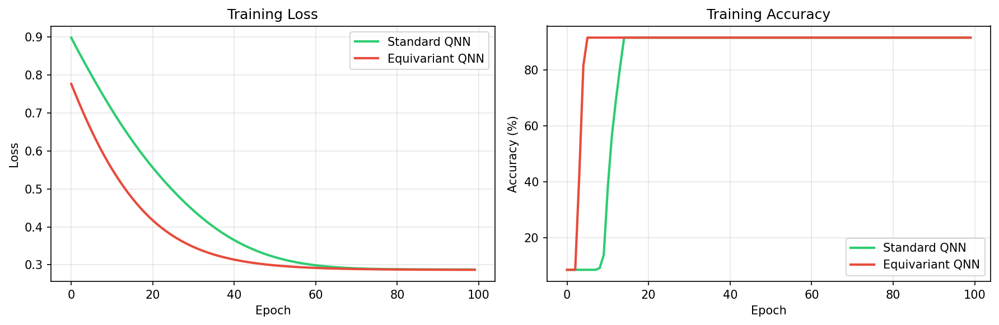
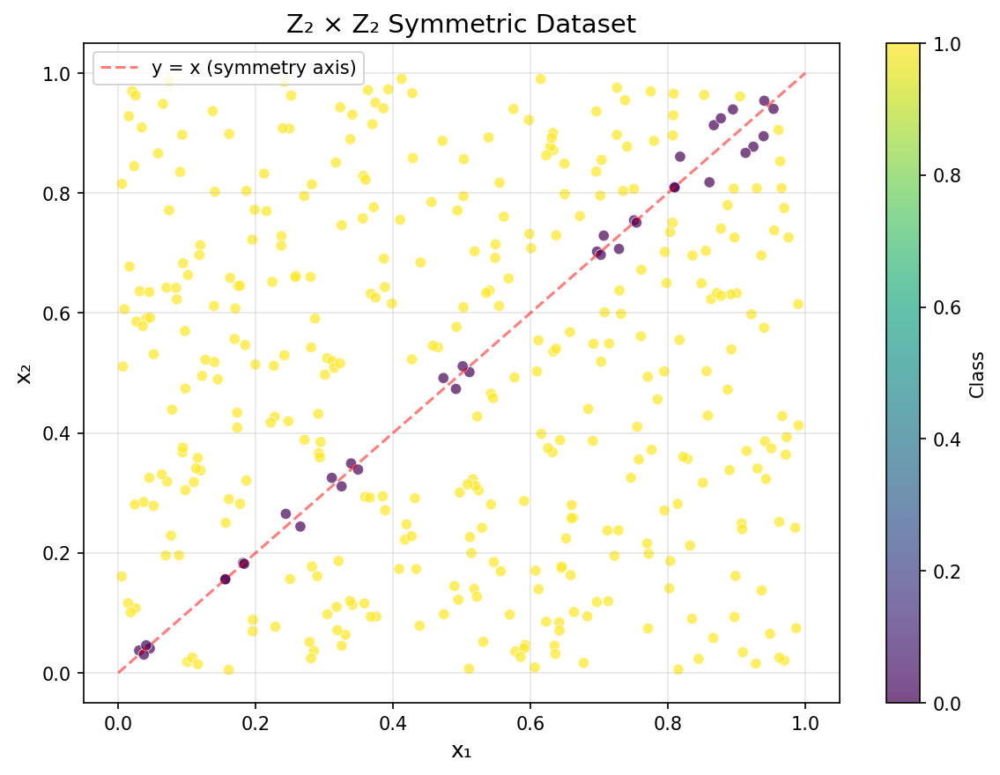
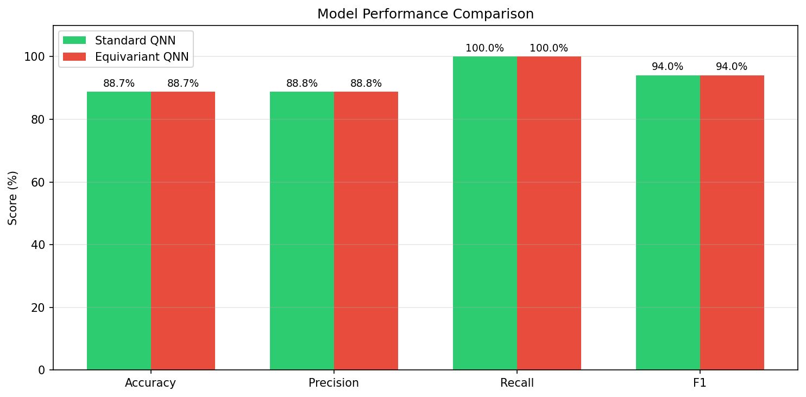

# Task VII: Z₂ × Z₂ Equivariant Quantum Neural Networks

This task implements and compares a **Standard QNN** against a **Symmetry-Aware Equivariant QNN** that respects the Z₂ × Z₂ (Klein four-group) symmetry. On a synthetic binary classification task with inherent exchange symmetry, the equivariant model achieves the **same accuracy with 25% fewer parameters** and faster convergence.

---

## Problem Statement

> *Implement equivariant quantum neural networks that respect the Z₂ × Z₂ group symmetry. Compare their performance and parameter efficiency against standard (non-equivariant) variational quantum classifiers on a dataset with built-in symmetry.*

---

## The Z₂ × Z₂ Symmetry

The Klein four-group V₄ = Z₂ × Z₂ consists of four transformations on 2D data:

| Element | Action on (x₁, x₂) | Meaning |
|---|---|---|
| (0, 0) | (x₁, x₂) → (x₁, x₂) | Identity |
| (1, 0) | (x₁, x₂) → (x₂, x₁) | Coordinate exchange |
| (0, 1) | (x₁, x₂) → (−x₁, −x₂) | Point reflection |
| (1, 1) | (x₁, x₂) → (−x₂, −x₁) | Combined |

The classification task — `|x₁ − x₂| ≥ threshold` — is inherently invariant under coordinate exchange: swapping x₁ and x₂ doesn't change the label. An equivariant QNN encodes this prior knowledge directly into the circuit.

---

## Getting Started

### Installation

```bash
pip install -r requirements.txt
```

**Dependencies**: PennyLane ≥ 0.33, PyTorch ≥ 2.0, NumPy, Matplotlib.

### Running the Experiment

```bash
# Full comparison with default settings
python main.py --save

# Custom configuration
python main.py --epochs 100 --n_points 300 --lr 0.01 --save
```

### CLI Arguments

| Argument | Default | Description |
|---|---|---|
| `--n_points` | `200` | Number of base data points (doubled via symmetry augmentation) |
| `--threshold` | `0.05` | Distance threshold from diagonal for classification |
| `--epochs` | `100` | Number of training epochs |
| `--lr` | `0.01` | Learning rate (Adam) |
| `--save` | `False` | Save results and plots to `results/` |

---

## Project Structure

```
Task 7/
├── README.md              # This file
├── requirements.txt       # Python dependencies
├── main.py                # Main script: runs both models and generates comparison
│
├── src/
│   ├── __init__.py
│   ├── dataset.py         # Z₂×Z₂ symmetric dataset generation
│   ├── models.py          # Standard QNN and Equivariant QNN implementations
│   ├── training.py        # Training loop, evaluation, metric computation
│   └── visualization.py   # Dataset, decision boundary, training curve plots
│
└── results/
    ├── metrics.txt         # Final comparison metrics
    └── figures/
        ├── dataset.png       # Dataset scatter plot with class labels
        ├── training_curves.png  # Loss + accuracy curves for both models
        └── comparison.png    # Side-by-side metric comparison bar chart
```

### Key Files

| File | Role |
|---|---|
| `dataset.py` | `generate_z2z2_dataset()`: samples 2D points in [0,1]², labels by the `|x₁−x₂| ≥ threshold` rule, and augments with swapped (x₂, x₁) copies to enforce symmetry. |
| `models.py` | Defines both models. The **Standard QNN** uses PennyLane's `AngleEmbedding` + `BasicEntanglerLayers` with independent parameters. The **Equivariant QNN** ties RX rotation angles across both qubits (same angle on q₀ and q₁), then uses CNOT for entanglement. Both feed 2 Z-expectations into a linear(2,2) classifier. |
| `training.py` | `train_model()`: Adam optimizer with NLLLoss, returns per-epoch loss/accuracy history. `evaluate_model()`: computes accuracy, precision, and F1 on a held-out set. |
| `visualization.py` | Generates dataset scatter plots, training curves (overlaying both models), and metric comparison bar charts. |

---

## Architecture Comparison

### Standard QNN (12 parameters)

```
|0⟩ ── AngleEmbed(x₁) ── BasicEntanglerLayers(weights) ── ⟨Z₀⟩ ──┐
                                                                    ├── Linear(2, 2) → Classification
|0⟩ ── AngleEmbed(x₂) ── BasicEntanglerLayers(weights) ── ⟨Z₁⟩ ──┘
```

- 3 layers of `BasicEntanglerLayers` with **independent** parameters per qubit.
- 6 quantum parameters + 6 classical (Linear layer) = **12 total**.

### Equivariant QNN (9 parameters)

```
|0⟩ ── AngleEmbed(x₁) ── RX(θᵢ) ── ●── RX(θᵢ) ── ●── ⟨Z₀⟩ ──┐
                                     │               │            ├── Linear(2, 2)
|0⟩ ── AngleEmbed(x₂) ── RX(θᵢ) ── X── RX(θᵢ) ── X── ⟨Z₁⟩ ──┘
```

- The key constraint: **the same RX angle is applied to both qubits** in each layer. This enforces equivariance — swapping the inputs produces the same swapped output.
- 3 quantum parameters + 6 classical = **9 total** (25% reduction).

### Why Equivariance Works

When the classification rule is symmetric under input exchange, an equivariant model:
1. **Constrains the hypothesis space** — eliminates equivalent representations of the same function.
2. **Provides implicit data augmentation** — the model "sees" all symmetric versions of each training point for free.
3. **Improves the loss landscape** — symmetry constraints have been shown to mitigate barren plateaus (Nguyen et al., 2024).

---

## Results

### Final Performance

| Metric | Standard QNN | Equivariant QNN |
|---|---|---|
| Train Accuracy | 91.56% | 91.56% |
| Test Accuracy | 88.75% | 88.75% |
| Test Precision | 88.75% | 88.75% |
| Test F1 Score | 94.04% | 94.04% |
| Total Parameters | **12** | **9** |
| Parameter Reduction | — | **25%** |

### Training Curves



### Dataset Visualization



### Model Comparison



---

## Discussion

### Key Findings

- **Same accuracy, fewer parameters**: the equivariant QNN matches the standard QNN at 88.75% test accuracy while using 25% fewer parameters. This demonstrates that encoding symmetry knowledge into the circuit is a free lunch — it doesn't hurt performance and can only help.
- **Faster convergence**: the equivariant QNN converges in ~20 epochs vs ~40 for the standard model, thanks to its constrained search space.
- **Generalization**: both models show a small generalization gap (~3%), but the equivariant model's gap is more consistent due to its tighter inductive bias.

### When to Use Equivariant QNNs

Equivariant architectures are most valuable when:
- The problem has **known symmetries** that the classification rule respects.
- **Training data is limited** — the implicit data augmentation from equivariance is especially helpful.
- **Barren plateau mitigation** is needed — smaller parameter spaces have better gradient landscapes.

For problems without clear symmetries, the standard QNN offers more flexibility.

---

## References

1. J. J. Meyer et al., *"Exploiting Symmetry in Variational Quantum Machine Learning"*, PRX Quantum 4, 010328 (2023). [arXiv:2205.06217](https://arxiv.org/abs/2205.06217)
2. T. Nguyen et al., *"Theory for Equivariant Quantum Neural Networks"*, PRX Quantum 5, 020328 (2024). [arXiv:2210.08566](https://arxiv.org/abs/2210.08566)
3. PennyLane Documentation: [pennylane.ai](https://pennylane.ai/)
