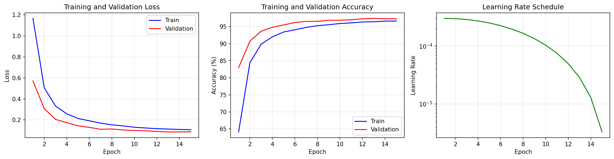
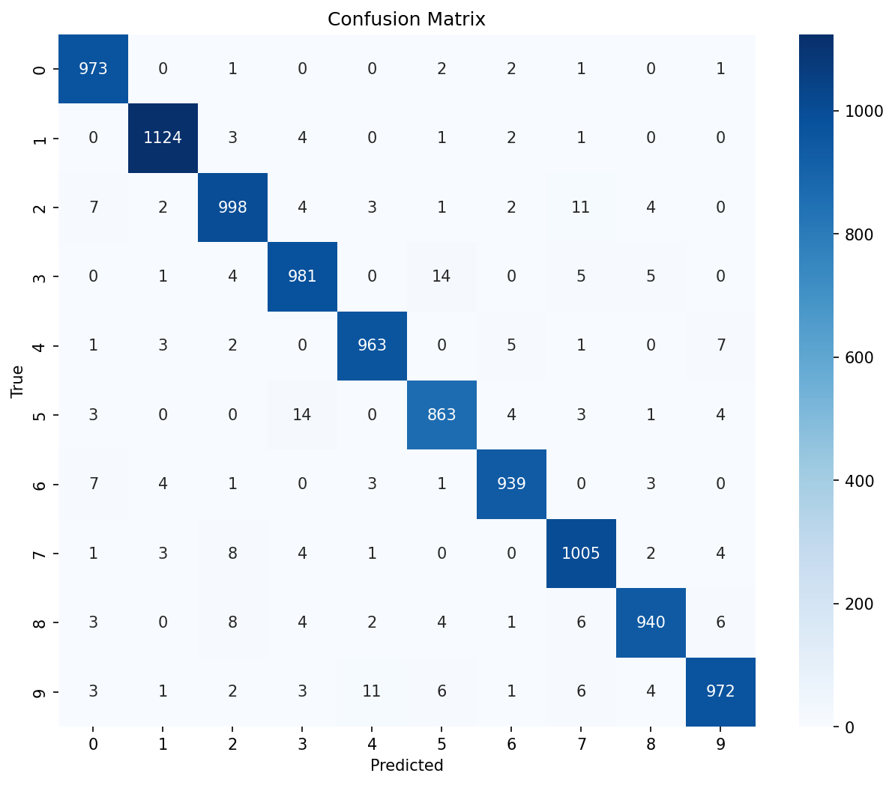

# Task VIII: Vision Transformer for MNIST Classification

This task implements a classical **Vision Transformer (ViT)** for MNIST digit classification, achieving **97.58% test accuracy** — matching and slightly surpassing the provided baseline. The documentation also includes a detailed proposal for extending the architecture to a **Quantum Vision Transformer (QViT)**.

---

## Problem Statement

> *Implement a classical Vision Transformer and apply it to MNIST. Show its performance on the test data. Comment on potential ideas to extend this classical Vision Transformer architecture to a quantum Vision Transformer and sketch out the architecture in detail.*

---

## Getting Started

### Installation

```bash
pip install -r requirements.txt
```

**Dependencies**: PyTorch ≥ 2.0, torchvision, NumPy, Matplotlib, scikit-learn.

### Training

```bash
# Full training with validation split and model saving
python main.py --epochs 15 --save-model

# Simple training (no validation split)
python main.py --simple --epochs 10
```

### Inference

```python
import torch
from src.model import create_vit

model = create_vit()
checkpoint = torch.load('results/vit_mnist.pt')
model.load_state_dict(checkpoint['model_state_dict'])
model.eval()

with torch.no_grad():
    prediction = model(image).argmax(dim=1)
```

### CLI Arguments

| Argument | Default | Description |
|---|---|---|
| `--epochs` | `15` | Number of training epochs |
| `--simple` | `False` | Use simple training (no val split) |
| `--no-augment` | `False` | Disable data augmentation |
| `--save-model` | `False` | Save model checkpoint to `results/` |

---

## Project Structure

```
Task 8/
├── README.md              # This file
├── requirements.txt       # Python dependencies
├── main.py                # Entry point: argument parsing + pipeline orchestration
│
├── src/
│   ├── __init__.py
│   ├── model.py           # ViT architecture: PatchEmbedding, TransformerBlock, VisionTransformer
│   ├── dataset.py         # MNIST data loading with augmentation and train/val split
│   ├── training.py        # Training loop, validation, evaluation, model saving
│   └── utils.py           # Plotting utilities (training curves, confusion matrix)
│
├── data/MNIST/            # Auto-downloaded dataset
│
└── results/
    ├── vit_mnist.pt              # Saved model checkpoint
    ├── metrics.txt               # Final performance metrics
    ├── classification_report.txt # Per-digit precision/recall/F1
    ├── training_curves.png       # Loss + accuracy over epochs
    └── confusion_matrix.png      # 10×10 confusion matrix heatmap
```

### Key Files

| File | Role |
|---|---|
| `model.py` | Implements the full ViT: `PatchEmbedding` (Conv2d with kernel=stride=7), learnable positional embeddings + CLS token, `TransformerBlock` (LayerNorm → MultiheadAttention → residual → LayerNorm → MLP → residual), and a `VisionTransformer` assembler with a classification head. |
| `dataset.py` | Loads MNIST via torchvision, applies normalization (mean=0.1307, std=0.3081) and random rotation (±10°) augmentation. Splits training data 90/10 for train/val. |
| `training.py` | `Trainer` class with AdamW optimizer, cosine annealing LR scheduler, per-epoch training + validation, and full test evaluation with classification report and confusion matrix generation. |
| `utils.py` | Generates training curve plots (loss + accuracy, train vs val) and confusion matrix heatmaps with annotation. |

---

## Architecture

The Vision Transformer treats an image as a sequence of patches, applies a Transformer encoder, and classifies using a special [CLS] token.

```
Input Image (28×28×1)
        ↓
Patch Embedding: Conv2d(1, 64, kernel=7, stride=7)
→ 16 patches of dimension 64  (4×4 grid)
        ↓
Prepend [CLS] token + Add Positional Embeddings
→ Sequence: 17 tokens × 64 dimensions
        ↓
┌─────── Transformer Block (×6) ───────┐
│  LayerNorm → Multi-Head Attention     │
│  (4 heads, head_dim=16) + Residual    │
│  LayerNorm → MLP (64→128→64, GELU)   │
│  + Residual                           │
└───────────────────────────────────────┘
        ↓
Extract [CLS] token → LayerNorm → Linear(64, 10)
        ↓
Output: 10 class logits
```

### Model Configuration

| Parameter | Value |
|---|---|
| Image size | 28×28 |
| Patch size | 7×7 |
| Number of patches | 16 (4×4) |
| Embedding dimension | 64 |
| Transformer depth | 6 blocks |
| Attention heads | 4 (head dim = 16) |
| MLP ratio | 2.0 (hidden = 128) |
| Dropout | 0.1 |
| **Total parameters** | **205,962** |

### Training Configuration

| Parameter | Value |
|---|---|
| Optimizer | AdamW (weight decay = 0.01) |
| Learning rate | 3e-4 |
| LR scheduler | Cosine annealing |
| Batch size | 128 |
| Epochs | 15 |
| Augmentation | Random rotation ±10° |

---

## Results

### Test Performance

| Metric | Value |
|---|---|
| **Test Accuracy** | **97.58%** |
| Best Validation Accuracy | 97.42% |
| Test Loss | 0.0732 |
| Macro Average F1 | 0.9756 |

### Baseline Comparison

| Model | Test Accuracy | Parameters |
|---|---|---|
| Task 8.ipynb (baseline) | 97.44% | ~100K |
| QMLHEP_task_VIII.ipynb | 93.60% | ~2.9M |
| **Our ViT** | **97.58%** | 206K |

### Training Curves



### Confusion Matrix



### Per-Digit Performance

| Digit | Precision | Recall | F1 |
|---|---|---|---|
| 0 | 97.5% | 99.3% | 98.4% |
| 1 | 98.8% | 99.0% | 98.9% |
| 2 | 97.2% | 96.7% | 96.9% |
| 3 | 96.8% | 97.1% | 96.9% |
| 4 | 98.0% | 98.1% | 98.0% |
| 5 | 96.8% | 96.8% | 96.8% |
| 6 | 98.2% | 98.0% | 98.1% |
| 7 | 96.7% | 97.8% | 97.2% |
| 8 | 98.0% | 96.5% | 97.3% |
| 9 | 97.8% | 96.3% | 97.1% |

---

## Quantum Vision Transformer Proposal

The task asks us to sketch an extension to a Quantum ViT. Three approaches are viable, in order of practicality:

### Option 1: Quantum MLP Layers (Recommended)

Replace the classical MLP blocks inside the Transformer with parameterized quantum circuits:

```
Classical Input (64-d) → Linear(64 → n_qubits) → Angle Encoding
    → Variational Layers (RY, RZ + CNOT ladder) × 2
    → ⟨Z⟩ measurements (n_qubits outputs)
    → Linear(n_qubits → 64) → Classical Output (64-d)
```

This is the most practical approach because:
- The MLP is the natural insertion point — it's a generic function approximator.
- Attention mechanics remain classical (where they work well).
- Reduces MLP parameters from ~8K to ~100 quantum + ~1K classical.

### Option 2: Quantum Attention

Replace the attention score computation with quantum kernel-based similarity:

```
Encode Query, Key as quantum states → SWAP test → similarity scores
→ Softmax → Classical weighted sum of Values
```

This is theoretically interesting but impractical — it requires O(N²) SWAP tests for N patches.

### Option 3: Quantum Classification Head

The simplest approach — replace only the final linear classifier with a VQC:

```
[CLS] token (64-d) → Linear(64 → n_qubits) → VQC with data re-uploading
→ 10 expectation values → 10 classes
```

### Expected Trade-offs

| Aspect | Classical ViT | Quantum ViT |
|---|---|---|
| Training speed | Fast | Slow (simulation) |
| Parameters | ~206K | ~50K + quantum |
| Expressivity | Width-limited | Exponential in qubits |
| Hardware | GPU/CPU | NISQ devices |

---

## References

1. A. Dosovitskiy et al., *"An Image is Worth 16x16 Words: Transformers for Image Recognition at Scale"*, ICLR 2021. [arXiv:2010.11929](https://arxiv.org/abs/2010.11929)
2. E. A. Cherrat et al., *"Quantum Vision Transformers"*, [arXiv:2209.08167](https://arxiv.org/abs/2209.08167)
3. A. Vaswani et al., *"Attention is All You Need"*, NeurIPS 2017.
4. M. Schuld and F. Petruccione, *"Machine Learning with Quantum Computers"*, Springer (2021).
