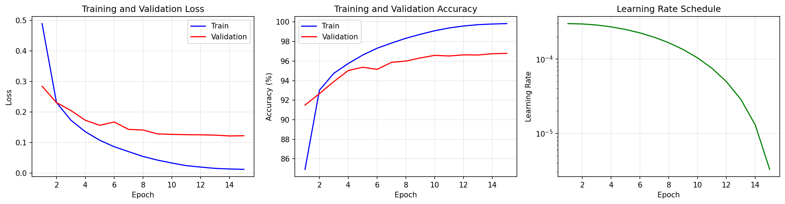
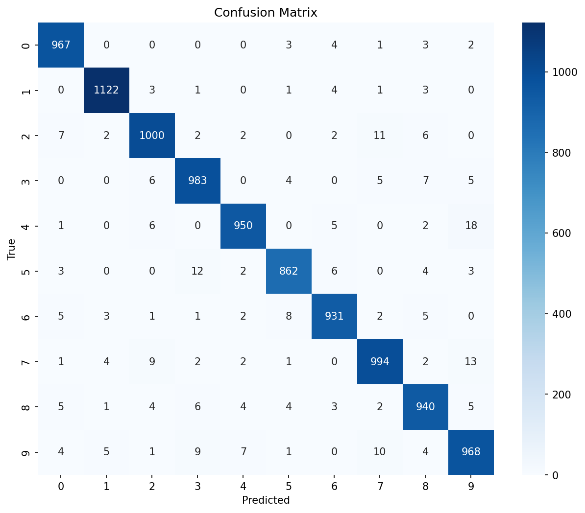

# Task IX: Kolmogorov-Arnold Network / Quantum KAN

## Task Description
Implement a classical Kolmogorov-Arnold Network using basis-splines or some other KAN architecture and apply it to MNIST. Show its performance on the test data. Comment on potential ideas to extend this classical KAN architecture to a quantum KAN and sketch out the architecture in detail.

## Results Summary

| Metric | Value |
|--------|-------|
| **Test Accuracy** | **97.17%** |
| Baseline (Task 9.ipynb) | 96.40% |
| Improvement | +0.77% |
| Parameters | 2,802,954 |
| Training Time | ~11 min (CPU) |

## Architecture

**Kolmogorov-Arnold Network (KAN)** with Gaussian basis functions:
- **Input**: 784 (flattened 28×28 image)
- **KAN Layer 1**: 784 → 256 (11 basis functions)
- **KAN Layer 2**: 256 → 128 (11 basis functions)
- **Classifier**: 128 → 10

### KAN vs MLP
| Aspect | MLP | KAN |
|--------|-----|-----|
| Activations | Fixed (ReLU) | Learnable (basis functions) |
| Weights | On nodes | On edges via basis coefficients |

## Quick Start

```bash
# Install dependencies
pip install -r requirements.txt

# Train enhanced KAN
python main.py --enhanced --epochs 15 --save-model

# Train baseline-matching KAN
python main.py --epochs 15
```

## Project Structure

```
Task 9/
├── src/                    # Source code
│   ├── model.py           # KAN layers (Gaussian, B-spline)
│   ├── dataset.py         # MNIST data loading
│   ├── training.py        # Training pipeline
│   └── utils.py           # Utilities
├── results/               # Training outputs
│   ├── metrics.txt        # Performance metrics
│   ├── training_curves.png
│   ├── confusion_matrix.png
│   └── kan_mnist.pt       # Saved model
├── main.py                # Entry point
├── PLANNING.md            # Planning document
├── DOCUMENTATION.md       # Full documentation
└── README.md              # This file
```

## Quantum KAN Proposal

The documentation includes a detailed proposal for extending to Quantum KAN:

1. **Quantum Basis Functions** - Replace Gaussian/B-spline with quantum feature maps
2. **Variational Quantum Circuits** - Learn "basis shapes" via parameterized gates
3. **Hybrid Architecture** - Classical dimensionality reduction + quantum KAN layer

See `DOCUMENTATION.md` for full architecture details and PennyLane implementation sketch.

## Training Curves



## Confusion Matrix



## References

- Liu et al., "KAN: Kolmogorov-Arnold Networks" (2024)
- Kolmogorov, "On the representation of continuous functions" (1957)
